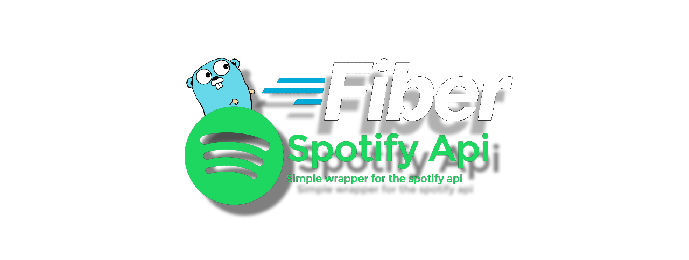

# Access Spotify Web Api using GoFiber.
</img>
## Usage:

1. Clone the repo

```BASH
git clone git@github.com:VictorBischoff/Spotify-gofiber.git
```

2. Enter the repo directory

```BASH
cd Spotify-gofiber
```

3. Run postgres

```BASH
docker compose up -d
```

4. Install dependencies

```BASH
go mod tidy
```

5. run the fiber server, and access at http://localhost:8080

```BASH
go run cmd/web/*.go
```
